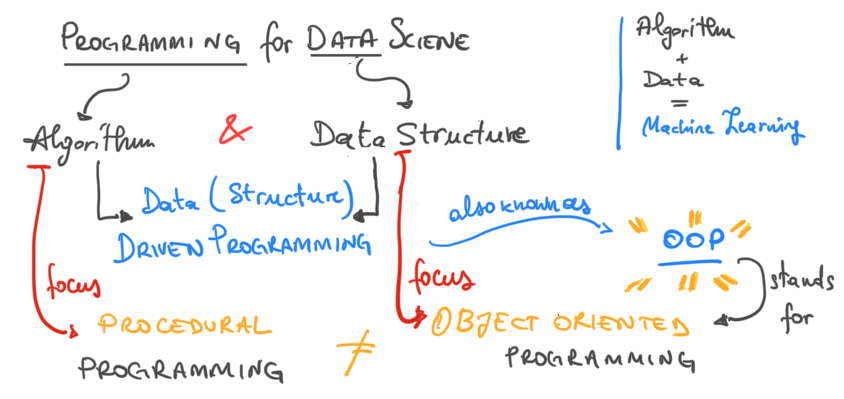

# Programming for Data Science @ FBK Academy

This is a programming tutorial aimed at researchers and practitioners with (potentially) no prior programming experience, as well as with previous programming skills. 

We will walk through several concepts to give you an introduction to some of the principal programming concepts like _conditionals_, _functions_, _iterations_, as well as more specialised topics like _classes_, _objects_ and what's sometimes called _defensive programming_.

_If all these terms sounds like [gibberish](https://en.wikipedia.org/wiki/Gibberish) to you, don't worry!_ 

 I'll try to show everything with simple code examples: no long and complicated explanations with fancy words. At the end of this tutorial, I am sure you will master all these concepts like a _pro_ 🙌

### Why Programming for _Data Science_ ?

In this tutorial we will be using **Python 3**. Python is nowadays considered as **"the"** language of choice for Data Science. 
There are indeed many reasons for that, and many articles have been written on the subject. 
This [article](https://analyticsindiamag.com/heres-why-python-continues-to-be-the-language-of-choice-for-data-scientists/) looks like a good and clear example on the topic.

#### A Few notes before we start

* `Q:` _Yes, ok.. but.. is this a tutorial on Data Science?_
* `A:` **No**. This is a **tutorial** on programming with Python. The _perspective_ though is of a _wanna-be_ data scientists.

* `Q:` _Cool... but.. is this a tutorial on the Python Language ?_
* `A:` **Ehm, No again. Sorry**. 
We will focus on programming concepts _using_ Python as a language. Most of the concepts you will learn are shared in most of other languages (_just the syntax will be different, ed._) _Although_ there is a section in the Lecture materials named `Python Extras` that is **specifically** focusing on features of the Python language. You could read it, if interested :)

#### Here is what I have in mind for this course (HTH)



_I do hope that this (very simple) mind-map look-alike clarifies a bit the perspective I chose when I thought about this course._

`tl,dr;` We will dive into programming focusing on two main aspects: the _Algorithmic_ perspective, that is "what are the steps we need to implement to solve a specific problem", and the _Data Structure_ perspective, that is "what is the data structure that would simplify as much as possible our algorithm implementation". These two perspectives led in the past decades to two completely different approaches to programming: **Procedural** vs **Object-Oriented**, respectively.

Python allows for _a lot_ of flexibility, and this flexibility will be our [swiss-knife](https://www.ctotech.io/blog/python/why-python3-insights-in-the-swiss-army-knife-of-coding/). In fact, Python supports _multiple programming paradigms_ at once (i.e _imperative_, _OOP_, _functional_ [1]), and we will be (seemingly) shifting our focus on those as we go along with the lecture materials.

---

`1`: functional programming only for the intrepid programmers of you :) See this [video](https://www.youtube.com/watch?v=ThS4juptJjQ)

## Outline of the Course (at a glance)

The course is organised into **six parts** lectures, with the following learning path in mind: 

1. Python Programming (part 1): Introduction to Python Main Data structures, and functions;

2. Python Programming (part 2): Advanced Data Structures and Object-Oriented Programming

3. Scientific Python Programming and Data Processing: Numerical Processing with `NumPy` & Data Processing with`Pandas`

4. Advanced Data Objects and Data Plotting: Introduction to `dataclasses` and `matplotlib` / `bokeh` for interactive plotting

5. Introduction to Scikit-Learn (`sklearn`) and Machine Learning Modules

6. Project-Team work on real-cases Data Science scenarios


## Lecture Materials

_Note: The following section is currently incomplete, and will be updated throughout the rest of the course._

### Introductory Readings (`intro` folder)

This part will introduce to the concept of computer programming, and to the 
very basics of the Python programming language:

1. [The Way of the Program](intro/1-the-way-of-the-program.html)
2. [Variables, Statements and Expressions](intro/2-variables-statements-expressions.html)
3. [Introduction to Functions](intro/3-intro-functions.html)
4. [Setting up an editor](intro/4-setup-editor.html)
5. [Conditional Statements](basics/5-conditionals.html)

Regardless you have already programmed before, using Python or not,  I would suggest to take a look at this introductory section anyway. There is always time to **skip**, based on your learning pace.

**Alternatively**, a good starting point would be this online course: [Intro to Python by Microsoft](https://docs.microsoft.com/en-us/learn/modules/intro-to-python/)

### Programming with Python (`programming_with_python` folder)
This section contains the materials for the main topics that will be covered in our first two lectures. These are (in no specific order):

1. [Pythonic Functions](programmin_with_python/functions.ipynb)
2. [Collections and Sequences](programmin_with_python/collections.ipynb)
3. [Dictionaries](programmin_with_python/dictionaries.ipynb)
4. [Iterators, Generators, Comprehensions](programmin_with_python/iterators.ipynb)
5. [Classes and OOP](programmin_with_python/classes.ipynb)
6. [Errors and Exceptions](programming_with_python/exceptions.ipynb)

####  Python Extras (`pyhton_extras` folder)
This section contains some extra notebooks you could go through to read more about some specific aspects of the Python programming language. 

**Note:** This is the only part of the course spefically focused on _how Python_ does things

1. [Modules](python_extras/modules.ipynb)
2. [Python Data Model](python_extras/data-model.ipynb)
3. [Function as Objects](python_extras/functions-objects.ipynb)
4. [Magic Methods](python_extras/magic.ipynb)
5. [ Pythonic Coding Style](python_extras/pep8.ipynb)

## Instructions

### 1. Get the material

**Option A**: `Clone` (or `fork`) the Repository using `git` (**Recommended**) 

⚠️ Note: It is necessary to have `Git` installed in order to proceed. If you don't have `git` installed on your system, you need to **install git** first. 
[Instructions to Install Git](https://git-scm.com/book/en/v2/Getting-Started-Installing-Git)

To acquire the lecture material it is highly recommendedn using `git` to **clone** the current repository. Since the repository will be constantly updated after each lesson, using git method will allow for an easier synchronisation of the material.

To clone the repository, type the following command in the terminal prompt: 
```bash
git clone https://github.com/leriomaggio/python-data-science.git
```

⚠️ Note for **Windows users**: Once installed `git`, please make sure to run the _Git Terminal_ (or _Git Prompt_)

Once completed, this will create a new folder named `python-data-science` (_presumably in your Home folder_).

Well done! Now you should bear with me another few minutes, following instructions reported below 🙏 (please see **2. Setting up your Environment**)


**Option B**: Downloading the material in a ZIP archive from GitHub (**Not Recommended**)

It is indeed possible to download the whole material from GitHub as a ZIP archive. 
Link [here](https://github.com/leriomaggio/python-data-science#:~:text=with%20GitHub%20Desktop-,Download%20ZIP,-Latest%20commit)

However, this method is **not recommended** as it will be required to download the archive everytime there is an update (which means at the end of each lesson)!

### 2. Setting up your Environment

We will be using [**Jupyter lab**](https://jupyter.org) as our _interactive programming environment_ for this course. 

This will have the great advantage of lowering the barriers in setting up the environment, and installing specialised tools. If you're not familiar with _jupyter notebooks_, no worries: we will get the time to familiarise with the environment as the first thing we will do!

Meanwhile, it is necessary to setup the Python **Virtual Environment** to run the code contained in this repository _smoothly_ and with no _headaches_.

If you don't know what a Python [virtual environment](https://docs.python.org/3/tutorial/venv.html) is, think of it as a sandbox Python installation you can have on your machine that is fully controllable and fully independent from any other Python environment you may have on your local machine.

To execute the notebooks in this repository, a few packages are required, but installing them in your Conda environment is super easy. 

**Step 1:** Download [Anaconda Python Distribution](https://www.anaconda.com/products/individual).

Note for **Windows Users**:  More information here on the [official documentation](https://docs.anaconda.com/anaconda/user-guide/getting-started/#open-nav-win)

**Step 2:** Set up the virtual environment:

Open a Terminal (or **Anaconda Prompt** on Windows) and **move** to the `python-data-science` folder, i.e. the main folder of this repository. 

```bash
cd python-data-science
```

Now create the conda environment by typing the following command:

```bash
conda env create -f pyds.yml
```
This will install a **new** Conda environment named `pyds`.

**Step 2.1**: If you'd like to double check that the creation of the environment completed successfully, you can type:

```bash
conda info --envs
```
This will list all the virtual environments conda can found within your installation. `pyds` should appear in the list as well.

**Step 3:**: Activate the environment:

Once the environment is set, we need to **activate** it in order to use it.

```bash
conda activate pyds
```

🎉 You should be now ready to go!

The last bit is to run your `jupyter lab` server, and open the notebooks:

```bash
jupyter lab
```

#### (Alternative) Setup Environment via `pip`

The repository also includes a `requirements.txt` file that can be used to install all the required packages using `pip`:

```bash
pip install -r requirements.txt
```

However this is recommended only if (A) it is not possible to install Anaconda on your machine; (B) The setup of Anaconda environment is unsuccessfull. 

⚠️ **Either is the case** it is important that the version of Python used will be `Python >=3.9`

## Colophon

**Author**: Valerio Maggio ([`@leriomaggio`](https://twitter.com/leriomaggio)), Senior Research Associate, University of Bristol. 

All the **Code** material is distributed under the terms of the GNU GPLv3 License. See [LICENSE](./LICENSE) file for additional details.

All the instructional materials in this repository is free to use, and made available under the [Creative Commons Attribution
license][https://creativecommons.org/licenses/by/4.0/]. The following is a human-readable summary of (and not a substitute for) the [full legal text of the CC BY 4.0
license](https://creativecommons.org/licenses/by/4.0/legalcode).

You are free:

* to **Share**---copy and redistribute the material in any medium or format
* to **Adapt**---remix, transform, and build upon the material

for any purpose, even commercially.

The licensor cannot revoke these freedoms as long as you follow the
license terms.

Under the following terms:

* **Attribution**---You must give appropriate credit (mentioning that
  your work is derived from work that is Copyright © Software
  Carpentry and, where practical, linking to
  http://software-carpentry.org/), provide a [link to the
  license][cc-by-human], and indicate if changes were made. You may do
  so in any reasonable manner, but not in any way that suggests the
  licensor endorses you or your use.

**No additional restrictions**---You may not apply legal terms or
technological measures that legally restrict others from doing
anything the license permits. 

### Contacts 

For any questions or doubts, feel free to open an [issue](https://github.com/leriomaggio/python-data-science/issues) in the repository, or drop me an email @ `valerio.maggio_at_bristol.ac.uk`